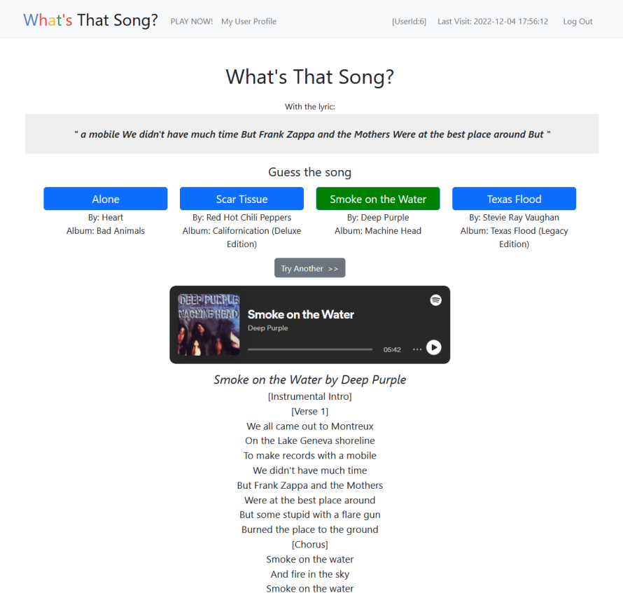
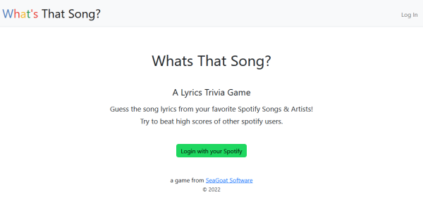

# What's That Song !?!

My final project for Harvard's [CS50x - Intro to Computer Science](https://cs50.harvard.edu/x/2022/).

### Video Demo

- LINK TBD...

### Game Description

This game tests a player's lyric knowledge, with songs in their own Spotify library. Here's how it works:

1. A player logs in to the game via [Spotify's OAuth 2.0](https://developer.spotify.com/documentation/general/guides/authorization/) authorization framework
2. The user's **Liked Songs** and **Playlists** are scanned for their favorite music
3. Each game round: a song is chosen **randomly**, a section of the lyrics are shown
4. The player guesses which song it is (multiple choice)
5. Full lyrics are then revealed, and a mini-player to hear the song

### Technical achievements so far

- Authenticated players via Spotify Authorization Code flow
- Called several Spotify APIs to retrieve player details and song data
- Created SQLite database to hold player details, high scores, and transient track data
  (reducing the number of repeated calls to Spotify)
- Retrieved lyrics from [genius.com](https://genius.com/) and [Chartlyrics API](http://www.chartlyrics.com/api.aspx)
- Implemented helper libraries for spotify, database, and game play functions - such as selecting random songs and choosing random lyric snippets.

&nbsp;

### Future improvements

I would call this an early beta.  The basic plumbing is there for gameplay, however:
- score keeping is not implemented yet
- the UI is very basic

&nbsp;

### Program Structure

The program is a flask web application in Python:

| File                  | Description |
| --------------------- | ----------- |
| **app.py**            | the main flask app |
| **db_helper.py**      | sqlite database functions |
| **game_helper.py**    | functions for gameply, e.g. get random songs and lyrics |
| **spotify_helper.py** | for spotify API calls |
