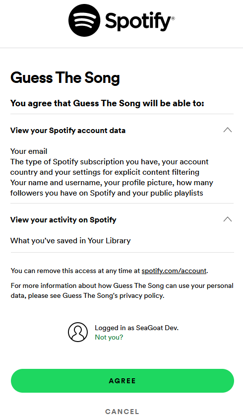

# What's That Song !?!

My final project for Harvard's [CS50x - Intro to Computer Science](https://cs50.harvard.edu/x/2022/).


- [What's That Song?](https://youtu.be/FkbKASX5vwE) (Game Demo: https://youtu.be/FkbKASX5vwE)


# Game Description

This game tests a player's lyric knowledge, with songs in their own Spotify library. Here's how it works:

1. A player logs in to the game via [Spotify's OAuth 2.0](https://developer.spotify.com/documentation/general/guides/authorization/) authorization framework
2. Their **Liked Songs** and **Playlists** are scanned for favorites
3. Each game round: a song is chosen **randomly**, and a section of lyrics shown
4. The player guesses which song it is (multiple choice)
5. Full lyrics are then revealed, and a mini-player to hear the song


## Technical achievements so far

- Authenticated players via Spotify [Authorization Code flow](https://developer.spotify.com/documentation/general/guides/authorization/code-flow/)
- Called several Spotify APIs to retrieve player details and song data
- A SQLite database holds player details, high scores, and transient track data (reduces repeated calls to Spotify)
- Song lyrics retrieved from [genius.com](https://genius.com/) and [Chartlyrics API](http://www.chartlyrics.com/api.aspx)
- Implemented helper libraries for spotify, database, and game play functions - such as selecting random songs and choosing random lyric snippets.
- Used some basic Bootstrap styling
- Implemented Github CI-CD workflows (see [main_wts1.yml](.github/workflows/main_wts1.yml)), deploying to Azure App Service on each git push


## Future improvements

This is an early beta. The basic plumbing is there for gameplay, however:
- score keeping is not implemented
- the UI is very basic
- lyric accuracy not guaranteed, as they're from external sources (not Spotify)


## Program Structure

The program is a flask web application, written in Python with a touch of JavaScript:

| File                  | Description |
| --------------------- | ----------- |
| **app.py**            | the main flask app |
| **db_helper.py**      | sqlite database functions |
| **game_helper.py**    | gameplay functions e.g. get random songs and lyrics |
| **spotify_helper.py** | spotify API helpers |


## Execution

To run the game locally:

- Create a `.env` file with the content shown below
- Run `flask run` in the root directory

```bash
WTS_CLIENT_ID = REDACTED_CLIENT_ID
WTS_CLIENT_SECRET = REDACTED_CLIENT_SECRET
WTS_REDIRECT_URI = http://127.0.0.1:5000/callback
USE_PROXY = False
FLASK_APP = app.py
```


### Program Flow

**Authentication:**

- A Player visits the site, first check if they are logged in

```python
@app.route('/')
def index():

    # Check if logged in user
    if "user_id" not in session:
        # not logged in - ask user to login w/ Spotify
        return render_template('login.html')
```

The Login page just displays a button, which takes the user to route /login. That request begins the Authorization Code flow with Spotify.
The program requests a certain "scope" of authorization, which the user must grant on first use.
Subsequent logins do not require this step.
```python
@app.route('/login')
def login():
    # Request user to authorize these scopes
    scope = 'user-read-private user-read-email user-library-read'
    payload = {
        'client_id': CLIENT_ID,
        'response_type': 'code',
        'redirect_uri': REDIRECT_URI,
        'state': state,
        'scope': scope,
    }
    response = make_response(redirect(f'{AUTH_URL}/?{urlencode(payload)}'))
    response.set_cookie('spotify_auth_state', state)
```



After redirecting through Spotify auth, user comes back to the "callback" handler in the game. This code is responsible to get a pair of tokens from Spotify, which includes the Access Token and Refresh Token. These are needed for continued calls to the Spotify API.

```python
@app.route('/callback')
def callback():
```

When this callback authentication dance is over, the player is finally redirected back to the root `/` to start playing.


**Caching User's Song Library**

On first load, the player's Liked Songs and Playlists are retrieved from Spotify.
https://developer.spotify.com/documentation/web-api/reference/#/operations/get-users-saved-tracks

In addition, their Playlists are scanned.
https://developer.spotify.com/documentation/web-api/reference/#/operations/get-a-list-of-current-users-playlists

Metadata about all tracks found in a player's library are cached into the SQLite database (track names, artists, and spotify URIs). This is needed for gameplay, and to reduce calls to Spotify.


**Game Flow**

The game will choose a random track from the user's library to start a game round.
Because Spotify does not expose a lyrics API, the game will search two external sources for song lyrics ([genius.com](https://genius.com/) and [Chartlyrics API](http://www.chartlyrics.com/api.aspx)).

A random snippet of the lyrics is selected. But before showing the player, those lyrics are processed to remove any giveaways from the song title.

Three more random tracks are selected from the library as "decoy tracks".  These make up the 3 incorrect choices, next to the correct song.


**Feedback to Player**

When the player makes a guess, instant feedback is given by coloring the buttons.  This is done with JavaScript manipulation of the DOM.  The "correct" choice button is set to green, and if the user clicked an "incorrect" guess then that button also changes to red.

JavaScript is also used to make the full lyrics appear after guessing. A mini-player also appears, to hear the song play on Spotify.


**User Profile**

The User Profile screen provides a visual listing of all the data upon which the gameplay is based.  This includes the Liked Songs, Playlists and Playlist Tracks that were found for the player.

----


**Secrets Handling**

Secrets are read from the OS environment vars (in app.py)

```python
CLIENT_ID = os.environ.get("WTS_CLIENT_ID")
CLIENT_SECRET = os.environ.get("WTS_CLIENT_SECRET")
REDIRECT_URI = os.environ.get("WTS_REDIRECT_URI")
```

----

